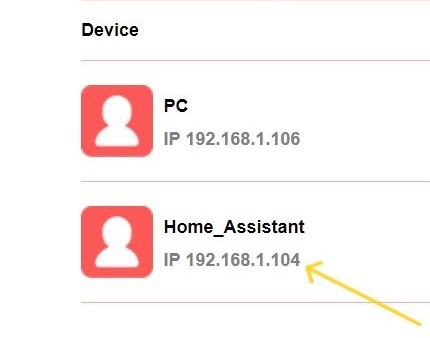

# Home Automation with Home Assistant
**Home automation project using Home Assistant for IoT device monitoring and control**

----

 

**Overview**

Transform your home into a smart space with this Home Assistant project. Easily monitor and control your IoT devices from a single dashboard. Enjoy automated tasks, energy efficiency, and enhanced comfort. This project provides a step-by-step guide to building your own home automation system. [learn-more](https://www.home-assistant.io/)

----

**Installation**
  
[Go here](https://www.home-assistant.io/installation/) and here install the type of installation you are comfortable with & follow each step mention properly.

----

  
**Steps**

- Install Home Assistant OS: Follow the on-screen instructions after booting from the downloaded image.
- Access Home Assistant: Open a web browser and go to the IP address. 
    `Default` (http://homeassistant.local:8123/),if this doesn't work you have to find your server's IP 
            either from below:

  - `1 HomeAssitant CLI` 
    - 
  - `2 Router's devices list` 
    - 

 
  
- Configure: Set up your account, location, and time zone.
- Integrate Devices: Add your IoT devices using the Home Assistant integration page.
  

----

