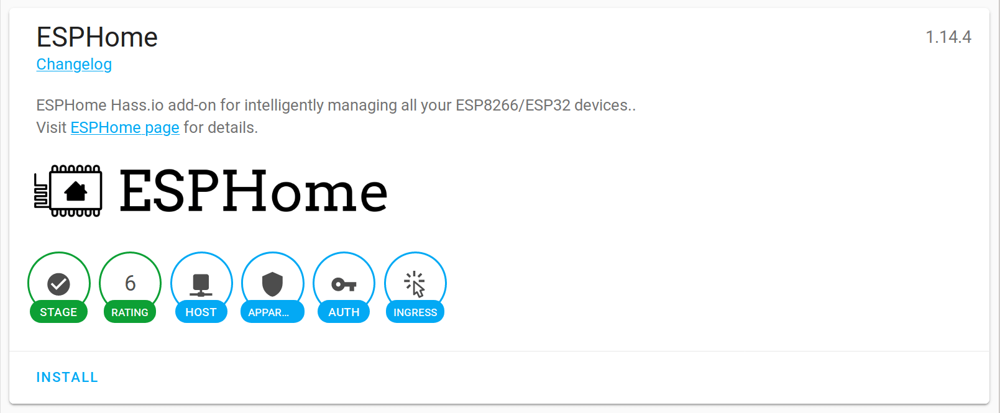
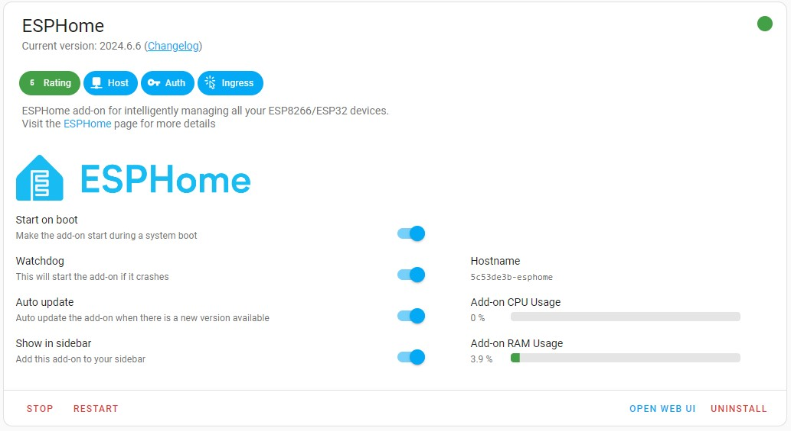
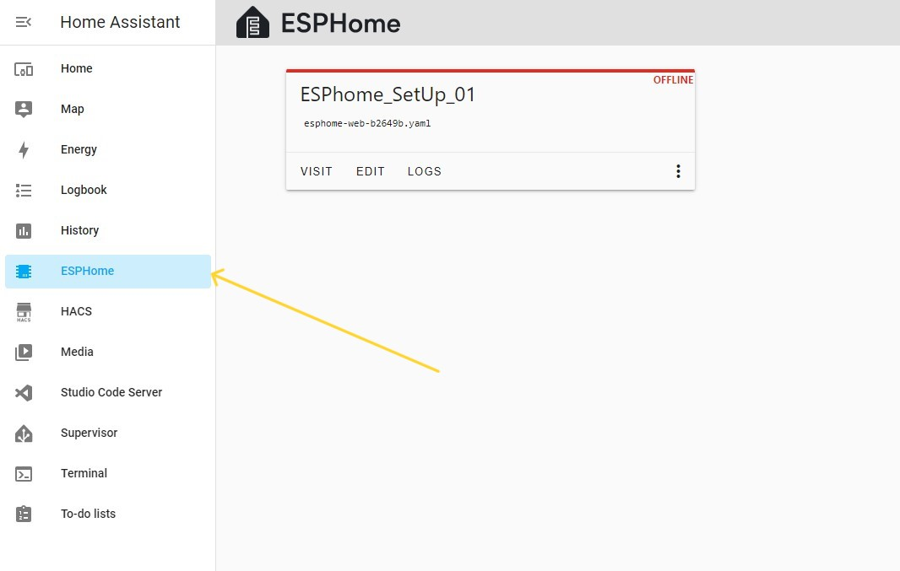
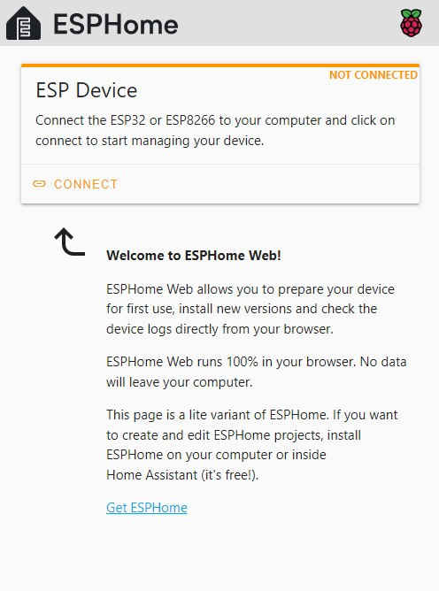
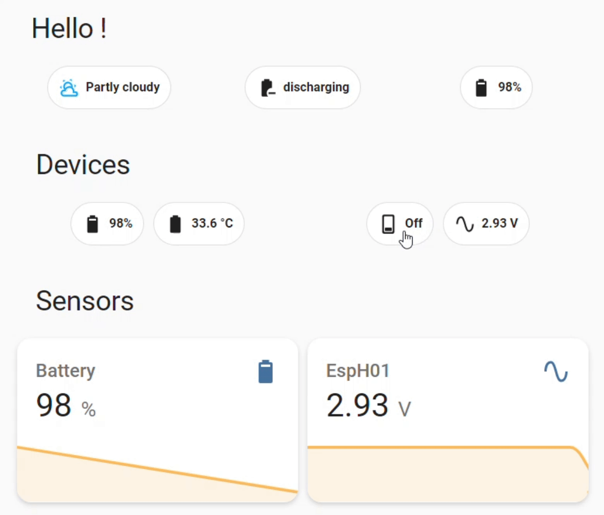

# Home Automation with Home Assistant 

**Home automation project using Home Assistant for IoT device monitoring and control**


----

<div align="justify"> 

**Overview**

Transform your home into a smart space with this Home Assistant project. Easily monitor and control your IoT devices from a single dashboard. Enjoy automated tasks, energy efficiency, and enhanced comfort. This project provides a step-by-step guide to building your own home automation system. [learn-more](https://www.home-assistant.io/)

</div>

----

**Installation**
  
[Go here](https://www.home-assistant.io/installation/) and here install the type of installation you are comfortable with & follow each step mention properly.

</div>

----

**Steps**

1. Install Home Assistant OS: Follow the on-screen instructions after booting from the downloaded image.
2. Access Home Assistant: Open a web browser and go to the IP address. 
    `Default IP address` (http://homeassistant.local:8123/), if this doesn't work you have to find your server's IP either from below:
  - `HomeAssitant CLI` : 
    - 
  - `Router's devices list` : 
    - 

3. Configure: Set up your account, location, and time zone. [follow-this-steps](https://www.home-assistant.io/getting-started/onboarding)
4. Integrate Devices: Add your IoT devices using the Home Assistant integration page.

----

<div align="justify"> 

## Customization with EspHome: 

**Add Esphome to Home Assistant:** 

- Go to -`Settings > Add-on Store > Search for " Esphome "`
  


- `click install and start add-on`



- `Go to Esphome menu on the left`
  


- `Add a new device by clicking new device`
- It will take you here : [Setup_newBoard](https://web.esphome.io/?dashboard_wizard)
- Connect the Esp-Board to the computer or laptop on which you have opened the Home Assistant dashboard for the setup.


- click `connect` and select your device if shown in the list if not reconnect or check for suitable drivers for your board
- Follow the next steps like `wifi credentials` and upload the EspHome firmware
-  Now your device will be shown in the esphome tab & you edit the code:

----

**Here is example of controlling A Led and monitoring value of an analog sensor**



```yaml

switch:
  - platform: gpio
    name : "LED"
    pin:
      number: GPIO2
      inverted: true

sensor:
  - platform: adc
    pin: VCC
    name: "power level"

```


</div>